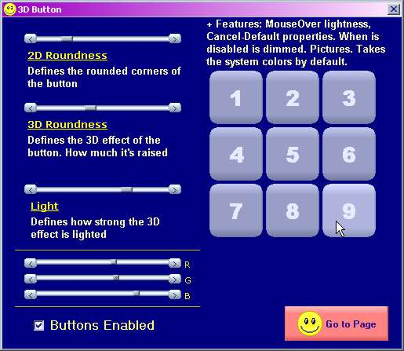



## Rounded 3D Button

### Description

OCX replacement for the command button. You can customize the roundness of the base (corners) and for the face (how much the button is raised to your eyes). You can define the amount of light/shadow that will affect the 3D effect. This control illuminates automatically when the focus and MouseOver event is on. You can give it any color you want, inluding system colors. It takes vbButtonFace color by default. Try with different values to all of these properties to paint the button with many different visual effects. Since cool ones, to sober and ellegant.

When pressed, the gradient inverts to give the sensation of pressed. Supports transparent pictures. with Default, Cancel and Disabled features.

Very light in weight. All 100% VB code.

You are free to use this any way you want! What do you think about it?
 
### More Info
 

             |
---                |---
**Submitted On**   |2002-06-01 14:42:44
**By**             |[Oscarreno](https://github.com/Planet-Source-Code/PSCIndex/blob/master/ByAuthor/oscarreno.md)
**Level**          |Advanced
**User Rating**    |4.9 (217 globes from 44 users)
**Compatibility**  |VB 5\.0, VB 6\.0
**Category**       |[OLE/ COM/ DCOM/ Active\-X](https://github.com/Planet-Source-Code/PSCIndex/blob/master/ByCategory/ole-com-dcom-active-x__1-29.md)
**World**          |[Visual Basic](https://github.com/Planet-Source-Code/PSCIndex/blob/master/ByWorld/visual-basic.md)
**Archive File**   |[Rounded\_3D89159612002\.zip](https://github.com/Planet-Source-Code/oscarreno-rounded-3d-button__1-34462/archive/master.zip)

